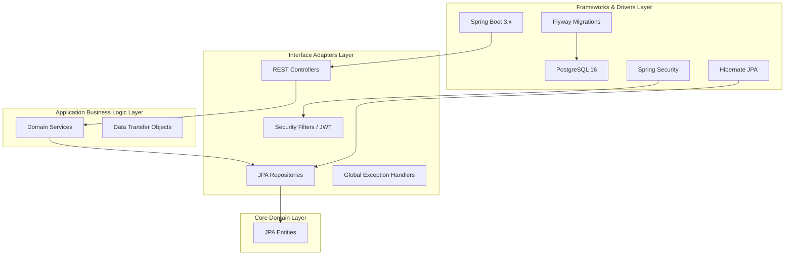
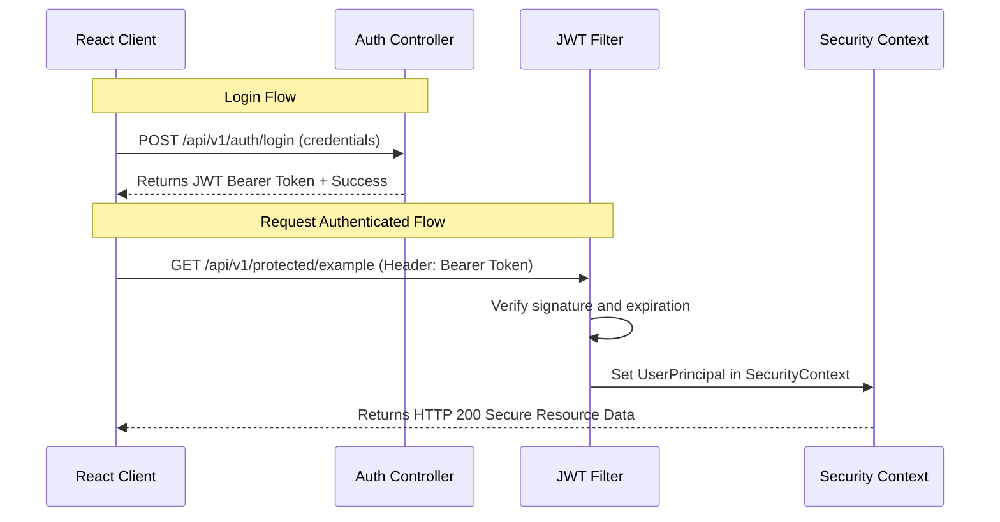

# ForgeMind X — Project Architecture

This document describes the structural design and system architecture of **ForgeMind X** (AI Software Engineering Operating System). The codebase is architected using **Clean Architecture** patterns, separating business logic from frameworks, frameworks from delivery mechanisms, and minimizing tight coupling.

---

## Clean Architecture Principles

We separate the backend into distinct layers with clear dependencies. Control flows inward, with higher-level policies unaware of lower-level delivery mechanisms (e.g. controllers or database drivers).

### Layer Definitions

1. **Core Domain Layer (`com.fordgex.forgemind.entity`)**
   - Contains core business entities (e.g., [User](file:///c:/Users/Admin/Desktop/PROJECTS/FORDGEX/backend/src/main/java/com/fordgex/forgemind/entity/User.java) and [Role](file:///c:/Users/Admin/Desktop/PROJECTS/FORDGEX/backend/src/main/java/com/fordgex/forgemind/entity/Role.java)).
   - Represents the enterprise business rules. Free of spring-framework dependencies except for standard JPA mappings.
   
2. **Application Business Logic Layer (`com.fordgex.forgemind.service`)**
   - Contains business logic workflows and boundary interfaces.
   - Decoupled from transport controllers. Orchestrates domain rules to fulfill client requests.

3. **Interface Adapters Layer (`com.fordgex.forgemind.controller` / `repository` / `dto`)**
   - **Controllers**: Exposes HTTP REST endpoints using standard wrappers ([ApiResponse](file:///c:/Users/Admin/Desktop/PROJECTS/FORDGEX/backend/src/main/java/com/fordgex/forgemind/common/ApiResponse.java)).
   - **Repositories**: Standard interfaces extending `JpaRepository` to perform CRUD transactions.
   - **DTOs**: Validated payloads mapped for inputs and outputs.
   
4. **Frameworks & Drivers Layer (`com.fordgex.forgemind.config` / `security` / `exception`)**
   - Configures Spring framework variables, database access pooling, CORS bindings, OpenApi configuration, JWT filters, and Spring Security rules.

---

## Authentication Flow

ForgeMind X uses **JWT (JSON Web Tokens)** for stateless session authentication.

